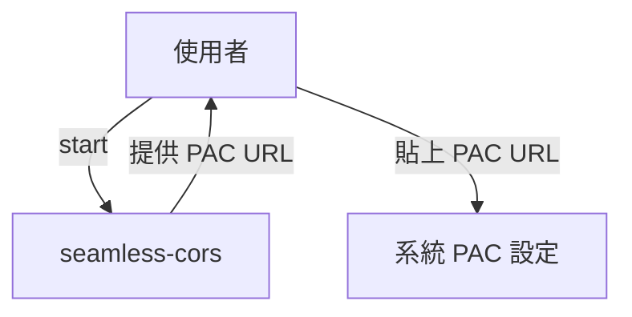
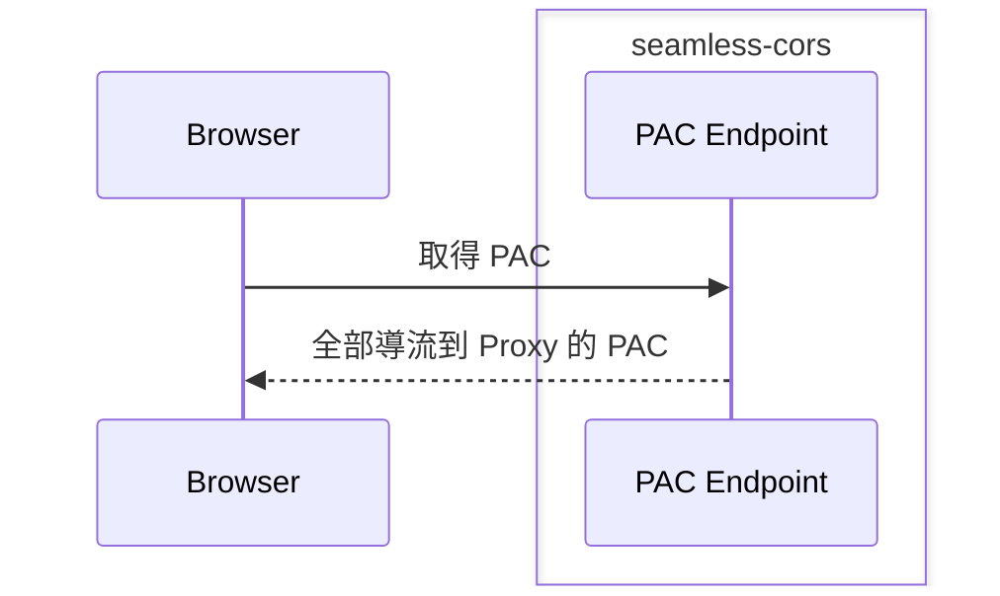
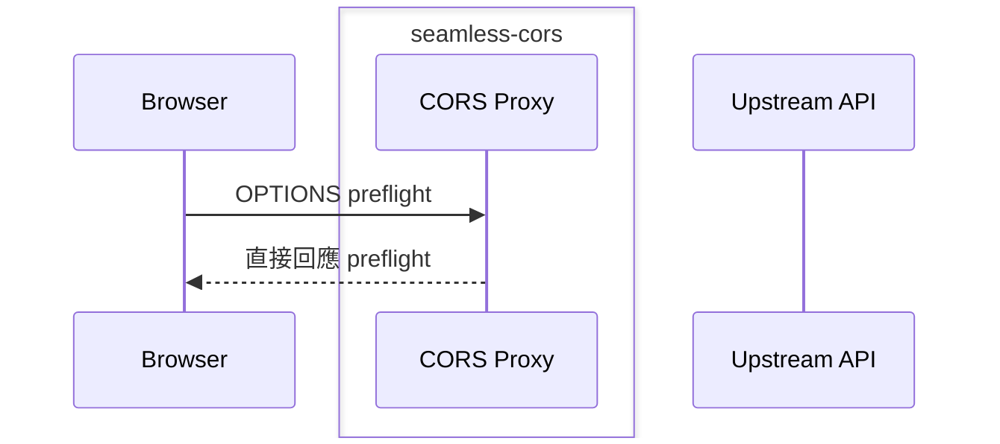
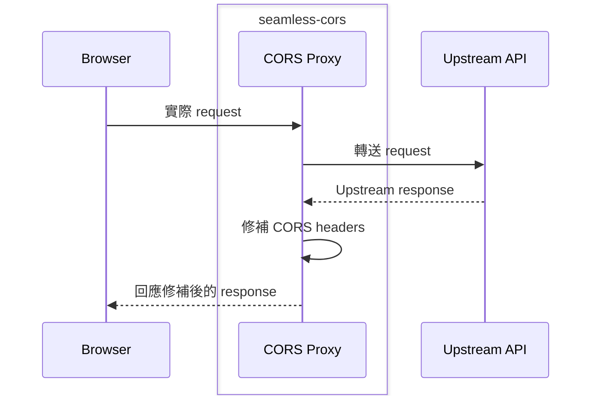

## Setup

```mermaid
flowchart TD
  User[使用者]
  SeamlessCors[seamless-cors]
  SystemPAC[系統 PAC 設定]

  User -->|start| SeamlessCors
  SeamlessCors -->|提供 PAC URL| User
  User -->|貼上 PAC URL| SystemPAC
```

## PAC Flow

```mermaid
sequenceDiagram
  participant Browser
  box seamless-cors
    participant PacEndpoint as PAC Endpoint
  end

  Browser->>PacEndpoint: 取得 PAC
  PacEndpoint-->>Browser: 全部導流到 Proxy 的 PAC
```

## Preflight Flow

```mermaid
sequenceDiagram
  participant Browser
  box seamless-cors
    participant CorsProxy as CORS Proxy
  end
  participant Upstream as Upstream API

  Browser->>CorsProxy: OPTIONS preflight
  CorsProxy-->>Browser: 直接回應 preflight
```

## Request Flow

```mermaid
sequenceDiagram
  participant Browser
  box seamless-cors
    participant CorsProxy as CORS Proxy
  end
  participant Upstream as Upstream API

  Browser->>CorsProxy: 實際 request
  CorsProxy->>Upstream: 轉送 request
  Upstream-->>CorsProxy: Upstream response
  CorsProxy->>CorsProxy: 修補 CORS headers
  CorsProxy-->>Browser: 回應修補後的 response
```
