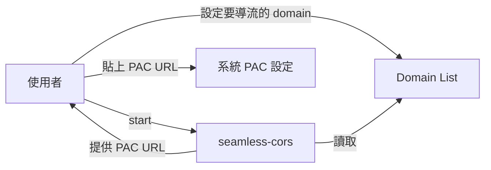
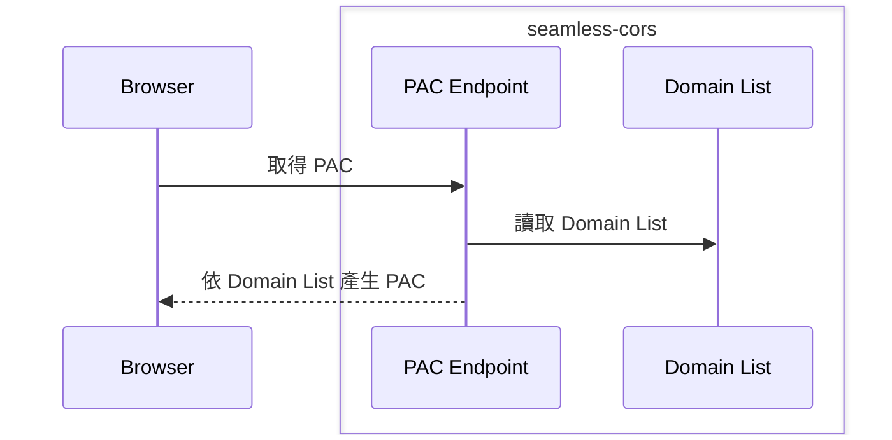
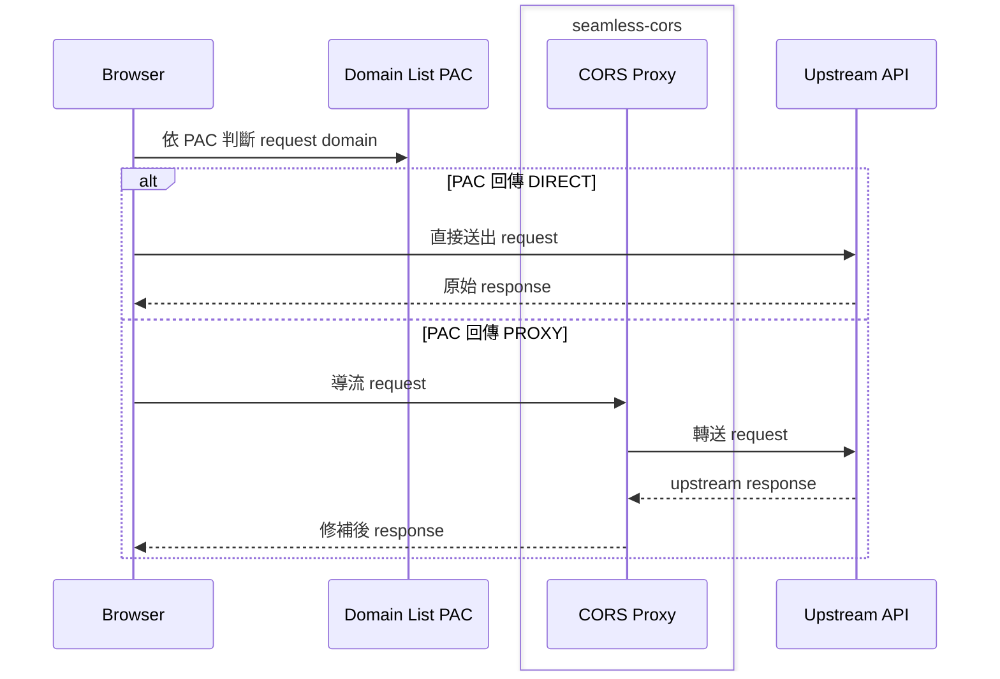
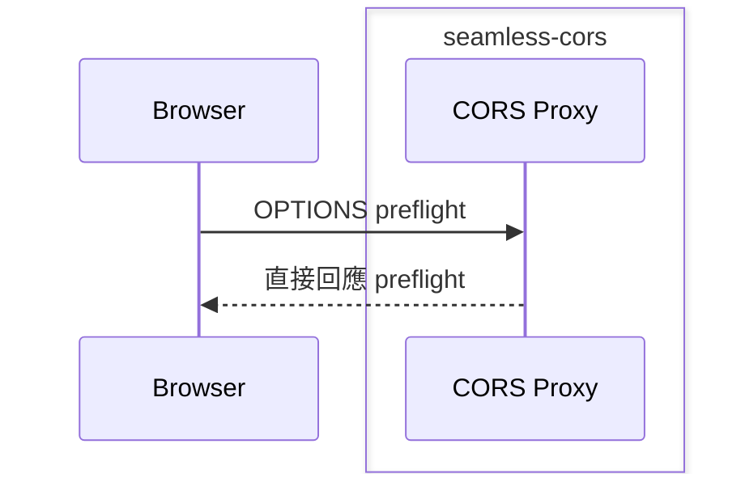
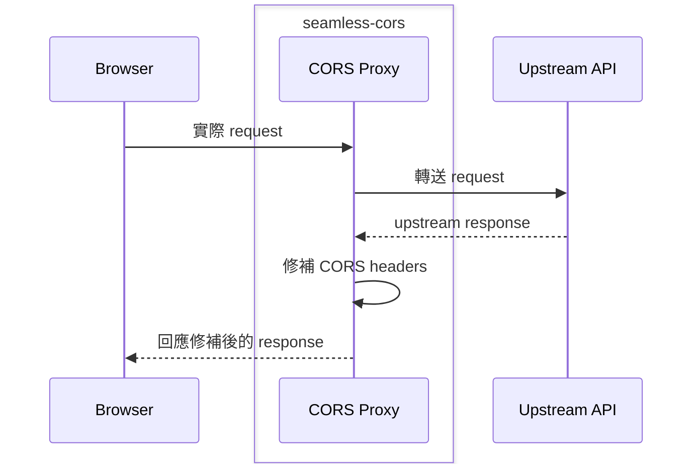

## Setup

```mermaid
flowchart LR
  User[使用者]
  SeamlessCors[seamless-cors]
  DomainList[Domain List]
  SystemPAC[系統 PAC 設定]

  User -->|設定要導流的 domain| DomainList
  User -->|start| SeamlessCors
  SeamlessCors -->|讀取| DomainList
  SeamlessCors -->|提供 PAC URL| User
  User -->|貼上 PAC URL| SystemPAC
```

## PAC Flow

```mermaid
sequenceDiagram
  participant Browser
  box seamless-cors
    participant PacEndpoint as PAC Endpoint
    participant DomainList as Domain List
  end

  Browser->>PacEndpoint: 取得 PAC
  PacEndpoint->>DomainList: 讀取 Domain List
  PacEndpoint-->>Browser: 依 Domain List 產生 PAC
```

## PAC Routing Flow

```mermaid
sequenceDiagram
  participant Browser
  participant DomainListPAC as Domain List PAC
  box seamless-cors
    participant CorsProxy as CORS Proxy
  end
  participant Upstream as Upstream API

  Browser->>DomainListPAC: 依 PAC 判斷 request domain
  alt PAC 回傳 DIRECT
    Browser->>Upstream: 直接送出 request
    Upstream-->>Browser: 原始 response
  else PAC 回傳 PROXY
    Browser->>CorsProxy: 導流 request
    CorsProxy->>Upstream: 轉送 request
    Upstream-->>CorsProxy: upstream response
    CorsProxy-->>Browser: 修補後 response
  end
```

## Preflight Flow

```mermaid
sequenceDiagram
  participant Browser
  box seamless-cors
    participant CorsProxy as CORS Proxy
  end

  Browser->>CorsProxy: OPTIONS preflight
  CorsProxy-->>Browser: 直接回應 preflight
```

## Request Flow

```mermaid
sequenceDiagram
  participant Browser
  box seamless-cors
    participant CorsProxy as CORS Proxy
  end
  participant Upstream as Upstream API

  Browser->>CorsProxy: 實際 request
  CorsProxy->>Upstream: 轉送 request
  Upstream-->>CorsProxy: upstream response
  CorsProxy->>CorsProxy: 修補 CORS headers
  CorsProxy-->>Browser: 回應修補後的 response
```
