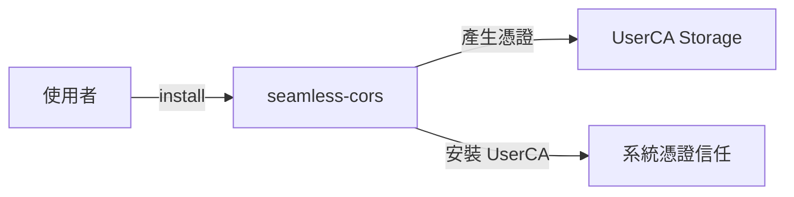
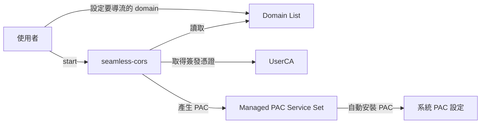
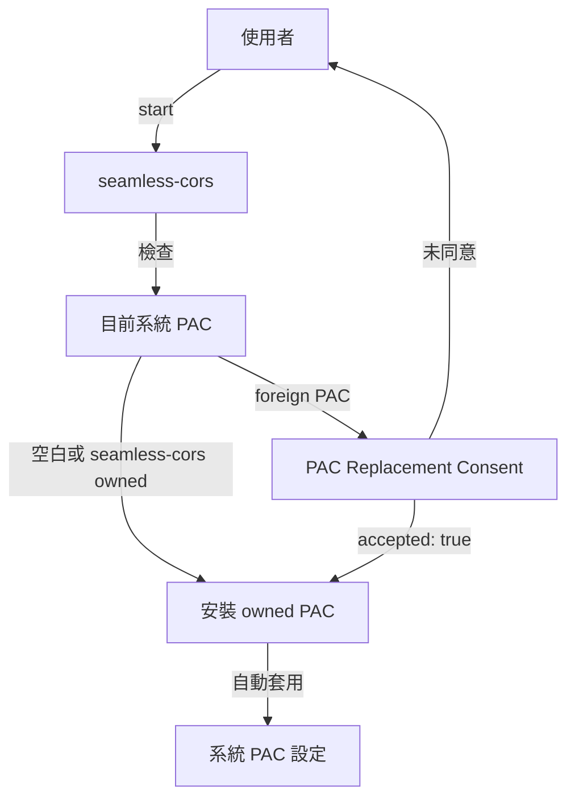
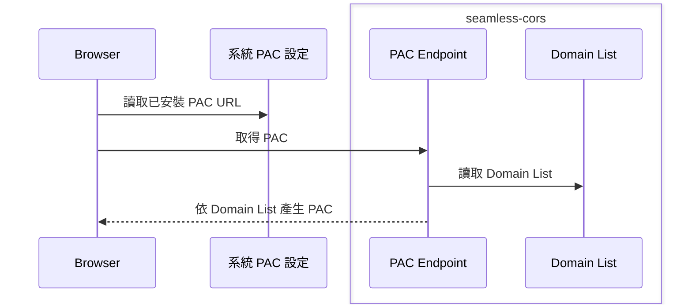
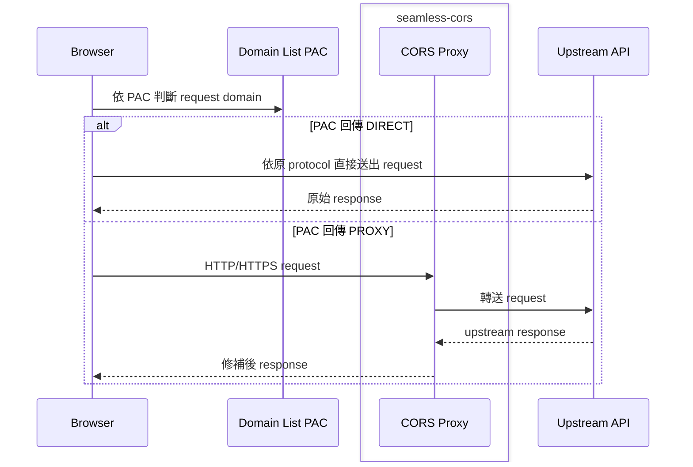
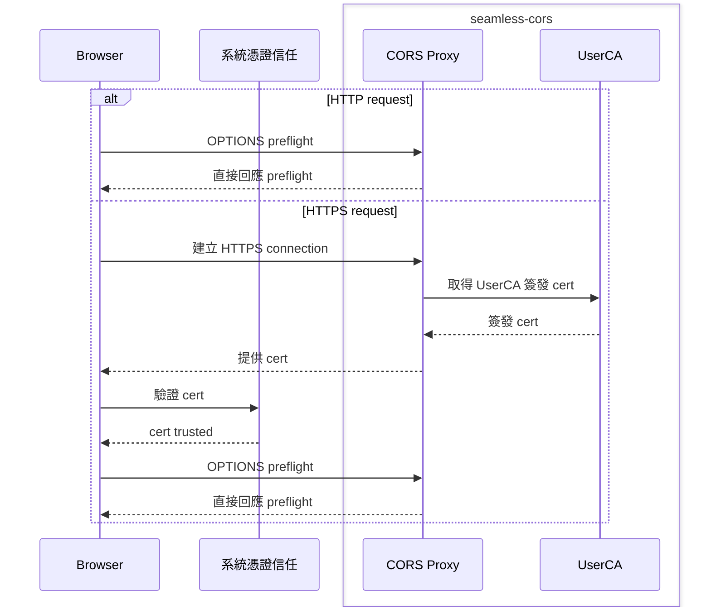
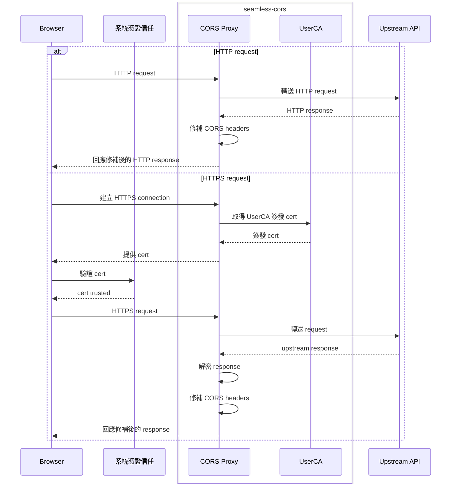

## CA Setup

```mermaid
flowchart LR
  User[使用者]
  SeamlessCors[seamless-cors]
  CAStorage[UserCA Storage]
  SystemTrust[系統憑證信任]

  User -->|install| SeamlessCors
  SeamlessCors -->|產生憑證| CAStorage
  SeamlessCors -->|安裝 UserCA| SystemTrust
```

## Gateway Setup

```mermaid
flowchart LR
  User[使用者]
  SeamlessCors[seamless-cors]
  DomainList[Domain List]
  UserCA[UserCA]
  ManagedPAC[Managed PAC Service Set]
  SystemPAC[系統 PAC 設定]

  User -->|設定要導流的 domain| DomainList
  User -->|start| SeamlessCors
  SeamlessCors -->|讀取| DomainList
  SeamlessCors -->|取得簽發憑證| UserCA
  SeamlessCors -->|產生 PAC| ManagedPAC
  ManagedPAC -->|自動安裝 PAC| SystemPAC
```

## PAC Replacement Consent

```mermaid
flowchart TD
  User[使用者]
  SeamlessCors[seamless-cors]
  CurrentPAC[目前系統 PAC]
  Consent[PAC Replacement Consent]
  Install[安裝 owned PAC]
  SystemPAC[系統 PAC 設定]

  User -->|start| SeamlessCors
  SeamlessCors -->|檢查| CurrentPAC
  CurrentPAC -->|空白或 seamless-cors owned| Install
  CurrentPAC -->|foreign PAC| Consent
  Consent -->|accepted: true| Install
  Consent -->|未同意| User
  Install -->|自動套用| SystemPAC
```

## PAC Flow

```mermaid
sequenceDiagram
  participant Browser
  participant SystemPAC as 系統 PAC 設定
  box seamless-cors
    participant PacEndpoint as PAC Endpoint
    participant DomainList as Domain List
  end

  Browser->>SystemPAC: 讀取已安裝 PAC URL
  Browser->>PacEndpoint: 取得 PAC
  PacEndpoint->>DomainList: 讀取 Domain List
  PacEndpoint-->>Browser: 依 Domain List 產生 PAC
```

## PAC Routing Flow

```mermaid
sequenceDiagram
  participant Browser
  participant DomainListPAC as Domain List PAC
  box seamless-cors
    participant CorsProxy as CORS Proxy
  end
  participant Upstream as Upstream API

  Browser->>DomainListPAC: 依 PAC 判斷 request domain
  alt PAC 回傳 DIRECT
    Browser->>Upstream: 依原 protocol 直接送出 request
    Upstream-->>Browser: 原始 response
  else PAC 回傳 PROXY
    Browser->>CorsProxy: HTTP/HTTPS request
    CorsProxy->>Upstream: 轉送 request
    Upstream-->>CorsProxy: upstream response
    CorsProxy-->>Browser: 修補後 response
  end
```

## Preflight Flow

```mermaid
sequenceDiagram
  participant Browser
  participant SystemTrust as 系統憑證信任
  box seamless-cors
    participant CorsProxy as CORS Proxy
    participant UserCA
  end

  alt HTTP request
    Browser->>CorsProxy: OPTIONS preflight
    CorsProxy-->>Browser: 直接回應 preflight
  else HTTPS request
    Browser->>CorsProxy: 建立 HTTPS connection
    CorsProxy->>UserCA: 取得 UserCA 簽發 cert
    UserCA-->>CorsProxy: 簽發 cert
    CorsProxy-->>Browser: 提供 cert
    Browser->>SystemTrust: 驗證 cert
    SystemTrust-->>Browser: cert trusted
    Browser->>CorsProxy: OPTIONS preflight
    CorsProxy-->>Browser: 直接回應 preflight
  end
```

## Request Flow

```mermaid
sequenceDiagram
  participant Browser
  participant SystemTrust as 系統憑證信任
  box seamless-cors
    participant CorsProxy as CORS Proxy
    participant UserCA
  end
  participant Upstream as Upstream API

  alt HTTP request
    Browser->>CorsProxy: HTTP request
    CorsProxy->>Upstream: 轉送 HTTP request
    Upstream-->>CorsProxy: HTTP response
    CorsProxy->>CorsProxy: 修補 CORS headers
    CorsProxy-->>Browser: 回應修補後的 HTTP response
  else HTTPS request
    Browser->>CorsProxy: 建立 HTTPS connection
    CorsProxy->>UserCA: 取得 UserCA 簽發 cert
    UserCA-->>CorsProxy: 簽發 cert
    CorsProxy-->>Browser: 提供 cert
    Browser->>SystemTrust: 驗證 cert
    SystemTrust-->>Browser: cert trusted

    Browser->>CorsProxy: HTTPS request
    CorsProxy->>Upstream: 轉送 request
    Upstream-->>CorsProxy: upstream response
    CorsProxy->>CorsProxy: 解密 response
    CorsProxy->>CorsProxy: 修補 CORS headers
    CorsProxy-->>Browser: 回應修補後的 response
  end
```
