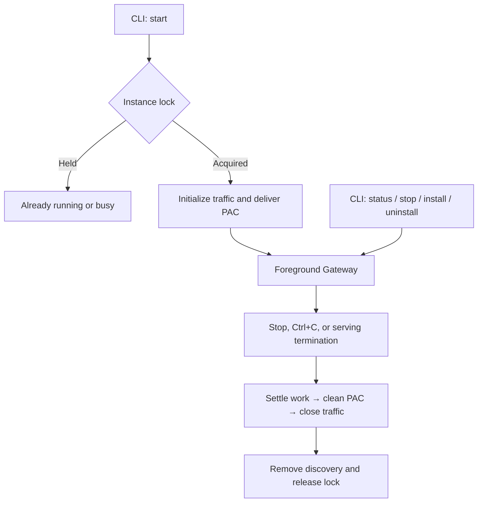

# Foreground Gateway management

Status: accepted

Gateway management had separate foreground hosting, control-only serve, remote startup, and temporary CA owners. These modes required a startup request protocol, consent retries, owner promotion rules, and startup supervision even though normal operation needs one foreground CLI process.

This decision supersedes those process modes and startup contracts in ADR-0001 and ADR-0013, the invoking-client startup path in ADR-0003, and repeated-start delivery in ADR-0012 and ADR-0013. ADR-0007 continues to govern the remaining authenticated control commands. Traffic projection, selector interpretation, CORS, HTTPS Facade, UserCA reconciliation, and System PAC safety contracts remain in force.

`start` holds the instance lock for its complete foreground lifetime. It captures the launching working directory, asks once for Global Upstream List creation consent, cleans stale discovery, establishes source and CA facts, starts traffic, and attempts initial System PAC delivery. Only then does it serve authenticated local control and publish discovery. Control supports status, stop, install, and uninstall; there is no control-only `serve` or HTTP `/start`.

A second `start` reports already-running without performing PAC delivery or changing runtime state. While initialization or offline work holds the lock without reachable control, competing commands report busy for explicit retry. Initialization belongs to the launching process context, so Ctrl+C cancels it; a different CLI cannot remotely preempt initialization. Startup failure or cancellation follows the same cleanup path as a running process.

Live CA commands retain owner-owned mutation: after admission they settle independently of client disconnect, withdraw HTTPS before trust changes, and restore it only from usable returned facts. Offline install and uninstall call UserCA directly under the same instance lock, publishing neither an HTTP server nor discovery state. Offline status also inspects under that lock. Losing acquisition to a newly initialized owner permits one rediscovery and forwarding attempt.

Shutdown runs once when explicit stop, a foreground signal, or serving termination ends the process. It closes admission, waits for admitted mutations and updates, cleans System PAC while traffic is available, closes traffic and observations, removes owned discovery, and releases the lock. The control server shuts down gracefully so a stop response can finish; no timed forced close is needed. Explicit stop stays fulfilled after best-effort cleanup and reports residue separately; the foreground process reports cleanup failure before exiting.

The instance boundary remains the selected per-user XDG runtime directory. This is not a machine-wide service. The ownership lock remains authoritative even if discovery is missing, and its release on process death permits later cleanup and restart. Offline stop can still clean owned crash residue under that lock. Foreign PAC settings remain protected.

Delivery recovery follows an effective Traffic Projection change or an explicit stop followed by start. Removing repeated-start repair makes the command behavior simpler and leaves each running process with one startup.

